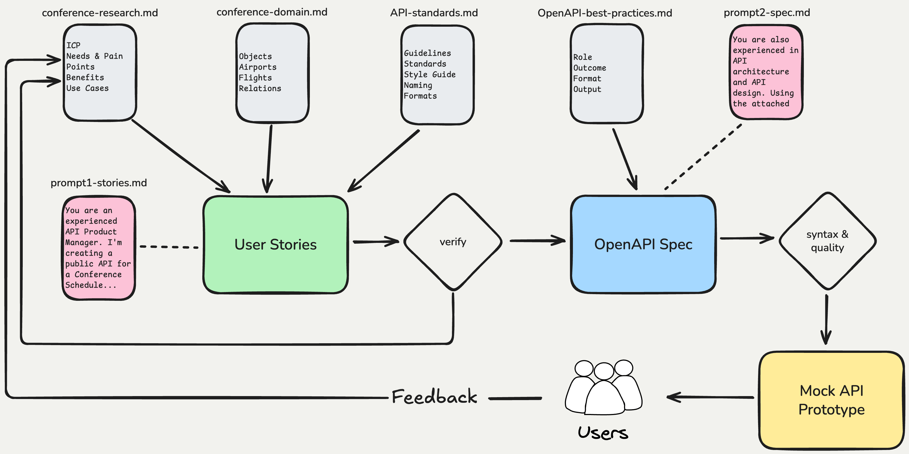

# AI-Driven API Design with OpenAPI

## Design a complete API spec in minutes using context files + LLMs.

The key idea: the prompts are tiny because all the knowledge lives in 4 context files. Each file represents a different role and can be maintained independently — separation of concerns.

We will use an API for an app that helps conference attendees as an exmaple.

## Context Files:

1. **Research** → [conference-research.md](conference-research.md) — The PM's job. Surveys, interviews, user requests, pain points, use cases. This is what you learn from talking to users.
2. **Domain** → [conference-domain.md](conference-domain.md) — The subject matter expert's job. Vocabulary, objects, fields, relations. The data model of your business domain.
3. **API Standards** → [API-standards.md](API-standards.md) — The architect's job. API guidelines for usability and consistency — naming, pagination, error handling, versioning. Add you own organization's guidelines or API style guide here.
4. **OpenAPI Best Practices** → [OpenAPI-best-practices.md](OpenAPI-best-practices.md) — Also the architect's job. Rules and conventions for well-structured OpenAPI specs that LLMs can generate correctly.

Four files, four concerns, each revved separately by the person closest to the knowledge.

## Steps:

1. **Build your context files** (see above).

2. **Generate user stories.** Attach the research, domain, and standards files and use this prompt:

```
You are an experienced API Product Manager.
I'm creating a public API for a Conference Schedule. Use my research, domain
and standards files attached and come up with short user stories for the
public API - just resources, methods and parameters for now.
```

Review the output — human in the loop. Example output: [conference-api-stories.md](conference-api-stories.md)

3. **Generate the OpenAPI spec.** Attach the standards, best practices, and stories files and use this prompt:

```
You are also experienced in API architecture and API design.
Using the attached API Standards document and OpenAPI best practices, along
with the user stories, generate the OpenAPI spec for the Conference Schedule
public API.
```

Example output: [conference-schedule-api-example.json](conference-schedule-api-example.json)

4. **Validate** using deterministic tools: [Swagger Editor](https://editor.swagger.io/), [RateMyOpenAPI](https://ratemyopenapi.com/), [OpenAPI Doctor](https://pb33f.io/doctor/), Spectral, Vacuum. More at [openapi.tools](https://openapi.tools/). For any errors or issues that show up, just paste them to the LLM's chat window and ask it to fix them. Note how our example is a public API with no authentication and most tools will flag that.

5. **Mock & test** with [Mockbin](https://mockbin.io/) or build an MVP on Replit to validate with customers. This is the step that separates great API Products from average ones.

## How to improve this workflow:

- Do your own customer validation, build your own Research & Domain files
- Customize the API and OpenAPI Standards docs for your organization
- Give the LLM more context about your business, market, other APIs & products
- Automate the mock & validation process — check OpenAPI into Git
- Use Claude Projects, Skills, and the md files in Claude Code

## Process overview:



## Slides:

[AI-Driven API Design with OpenAPI — DevWeek 2026](https://docs.google.com/presentation/d/1xY5OaF3bOuyFVH0FdweCA5WQyMF46UoTWJ4o-MVhgBU/edit?usp=sharing)

## Learn more:

- [API courses on Maven](https://maven.com/emmanuel)
- [Emmanuel Paraskakis on LinkedIn](https://www.linkedin.com/in/emmanuelparaskakis/)
